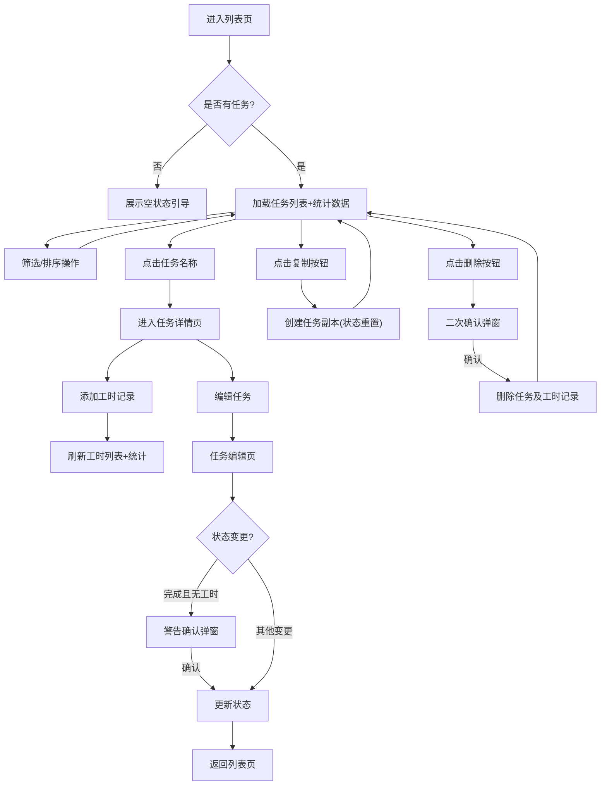

## 1. 产品概述

团队任务分配与工时记录系统是一个面向团队协作的任务管理工具，帮助团队管理者分配任务、跟踪进度、记录工时并进行数据统计分析。

- 核心目标：提供简洁高效的任务全生命周期管理，从创建、分配、执行到完成，完整记录工时消耗
- 目标用户：项目经理、团队负责人、开发团队成员
- 产品价值：提升任务透明度，合理评估工作量，优化资源分配

## 2. 核心功能

### 2.1 用户角色

| 角色 | 注册方式 | 核心权限 |
|------|----------|----------|
| 普通用户 | 无需注册（单用户系统） | 任务CRUD、工时记录、统计查看 |

### 2.2 功能模块

1. **任务列表页**：全局统计、任务表格、筛选排序、分页、快捷操作
2. **任务详情页**：任务信息展示、工时记录列表、快速添加工时、工时对比
3. **任务编辑页**：任务表单、状态流转校验
4. **新建任务页**：任务创建表单

### 2.3 页面详情

| 页面名称 | 模块名称 | 功能描述 |
|----------|----------|----------|
| 任务列表页 | 顶部统计栏 | 展示总任务数、进行中任务数、逾期任务数、总预估工时、总实际工时 |
| 任务列表页 | 筛选排序区 | 状态筛选、优先级筛选、项目筛选、截止日期排序 |
| 任务列表页 | 任务表格 | 任务列表展示，逾期提醒（⏰图标+红色日期），操作按钮（查看/编辑/复制/删除） |
| 任务列表页 | 分页控件 | 每页5条，仅当总数超过5条时显示 |
| 任务列表页 | 空状态引导 | 无任务时展示引导创建 |
| 任务详情页 | 任务信息卡 | 展示任务完整信息、状态标签 |
| 任务详情页 | 工时对比面板 | 预估工时、实际工时、差值（超时/节省/恰好标签） |
| 任务详情页 | 工时记录列表 | 按日期倒序排列，新记录高亮闪烁 |
| 任务详情页 | 快速添加工时 | 内联表单，日期默认当天 |
| 任务编辑页 | 任务表单 | 修改任务信息，状态遵循单向流转规则 |
| 新建任务页 | 任务表单 | 创建新任务，状态默认"待开始" |

## 3. 核心流程

## 4. 用户界面设计

### 4.1 设计风格
- **主色调**：深蓝色 #2563eb（专业、可靠）
- **辅助色**：
  - 高优先级/逾期：#ef4444（红色）
  - 进行中：#f59e0b（琥珀色）
  - 已完成/节省：#10b981（绿色）
  - 中优先级：#f59e0b（橙色）
  - 低优先级：#6b7280（灰色）
- **按钮风格**：圆角8px，悬停微缩放效果，阴影过渡
- **字体**：
  - 标题：'Noto Sans SC'，字重600
  - 正文：'Noto Sans SC'，字重400
  - 数字统计：'JetBrains Mono'，等宽字体
- **布局风格**：卡片式布局，顶部导航，内容区域左右留白充足
- **图标风格**：统一使用emoji或简洁线性图标

### 4.2 页面设计概述

| 页面名称 | 模块名称 | UI元素 |
|----------|----------|--------|
| 任务列表页 | 顶部统计栏 | 5个统计卡片，数值醒目，渐变色背景，悬停上浮效果 |
| 任务列表页 | 筛选区 | 下拉选择器，标签式布局，简洁边框 |
| 任务列表页 | 任务表格 | 斑马线效果，悬停高亮，逾期行红色字体，闹钟图标 |
| 任务详情页 | 工时对比 | 三色标签（超时红/节省绿/恰好灰），差值保留一位小数 |
| 任务详情页 | 新记录高亮 | 淡绿色背景闪烁两次，间隔300ms |
| 全局 | 弹窗确认 | 半透明遮罩，居中卡片，操作按钮左右分布 |

### 4.3 响应性
- 桌面端优先设计（≥1280px）
- 平板端（≥768px）：表格水平滚动，统计卡片改为2列布局
- 移动端（<768px）：统计卡片垂直堆叠，表格改为卡片列表展示

### 4.4 动效设计
- 页面加载：元素渐入+轻微上移，stagger延迟100ms
- 按钮悬停：scale(1.02) + 阴影加深
- 状态变更：标签颜色过渡动画300ms
- 新记录高亮：背景色从#dcfce7淡入淡出，循环2次
- 弹窗出现：scale(0.95→1) + 透明度过渡200ms
