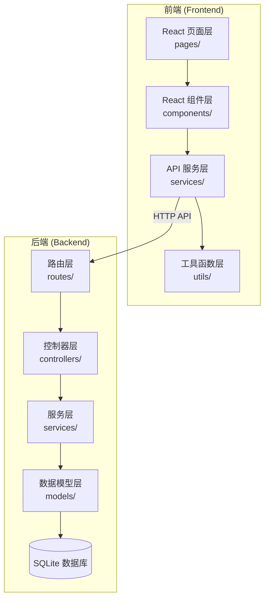
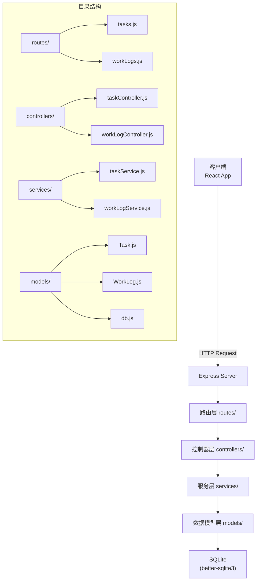
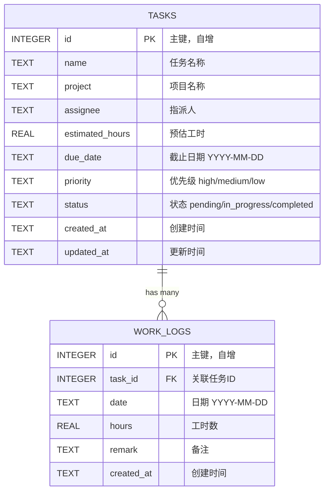

## 1. 架构设计



## 2. 技术说明

- **前端**：React 18 + Vite 5 + React Router 6
- **样式**：TailwindCSS 3
- **HTTP客户端**：Axios
- **后端**：Node.js + Express 4
- **数据库**：SQLite (better-sqlite3)
- **日期处理**：dayjs
- **初始化工具**：npm create vite@latest

## 3. 路由定义

### 前端路由

| 路由 | 页面 | 用途 |
|------|------|------|
| / | TaskListPage | 任务列表页（首页） |
| /tasks/new | TaskCreatePage | 新建任务页 |
| /tasks/:id | TaskDetailPage | 任务详情页 |
| /tasks/:id/edit | TaskEditPage | 任务编辑页 |

### 后端API路由

| 方法 | 路由 | 用途 |
|------|------|------|
| GET | /api/tasks | 获取任务列表（支持筛选、排序、分页） |
| GET | /api/tasks/stats | 获取全局统计数据 |
| GET | /api/tasks/:id | 获取单个任务详情（含工时记录） |
| POST | /api/tasks | 创建新任务 |
| PUT | /api/tasks/:id | 更新任务 |
| DELETE | /api/tasks/:id | 删除任务及其工时记录 |
| POST | /api/tasks/:id/copy | 复制任务 |
| GET | /api/tasks/:id/work-logs | 获取任务工时记录 |
| POST | /api/tasks/:id/work-logs | 添加工时记录 |

## 4. API 定义

### 数据类型

```typescript
// 任务状态
type TaskStatus = 'pending' | 'in_progress' | 'completed';

// 优先级
type Priority = 'high' | 'medium' | 'low';

// 任务
interface Task {
  id: number;
  name: string;
  project: string;
  assignee: string;
  estimatedHours: number;
  dueDate: string; // YYYY-MM-DD
  priority: Priority;
  status: TaskStatus;
  createdAt: string;
  updatedAt: string;
  workLogs?: WorkLog[];
  totalActualHours?: number;
}

// 工时记录
interface WorkLog {
  id: number;
  taskId: number;
  date: string; // YYYY-MM-DD
  hours: number;
  remark: string;
  createdAt: string;
}

// 统计数据
interface Stats {
  totalTasks: number;
  inProgressTasks: number;
  overdueTasks: number;
  totalEstimatedHours: number;
  totalActualHours: number;
}

// 分页结果
interface PaginatedResult<T> {
  data: T[];
  total: number;
  page: number;
  pageSize: number;
  totalPages: number;
}
```

### 请求/响应示例

**GET /api/tasks**
- Query: status, priority, project, sortBy (dueDate), sortOrder (asc/desc), page, pageSize
- Response: `PaginatedResult<Task>`

**GET /api/tasks/stats**
- Response: `Stats`

**POST /api/tasks**
- Request: `{ name, project, assignee, estimatedHours, dueDate, priority, status }`
- Response: `Task`

**POST /api/tasks/:id/work-logs**
- Request: `{ date, hours, remark }`
- Response: `WorkLog`

## 5. 服务器架构图



## 6. 数据模型

### 6.1 数据模型定义



### 6.2 数据定义语言

```sql
-- 任务表
CREATE TABLE IF NOT EXISTS tasks (
  id INTEGER PRIMARY KEY AUTOINCREMENT,
  name TEXT NOT NULL,
  project TEXT NOT NULL,
  assignee TEXT NOT NULL,
  estimated_hours REAL NOT NULL DEFAULT 0,
  due_date TEXT NOT NULL,
  priority TEXT NOT NULL CHECK(priority IN ('high', 'medium', 'low')),
  status TEXT NOT NULL DEFAULT 'pending' CHECK(status IN ('pending', 'in_progress', 'completed')),
  created_at TEXT NOT NULL,
  updated_at TEXT NOT NULL
);

-- 工时记录表
CREATE TABLE IF NOT EXISTS work_logs (
  id INTEGER PRIMARY KEY AUTOINCREMENT,
  task_id INTEGER NOT NULL,
  date TEXT NOT NULL,
  hours REAL NOT NULL,
  remark TEXT DEFAULT '',
  created_at TEXT NOT NULL,
  FOREIGN KEY (task_id) REFERENCES tasks(id) ON DELETE CASCADE
);

-- 索引
CREATE INDEX IF NOT EXISTS idx_tasks_status ON tasks(status);
CREATE INDEX IF NOT EXISTS idx_tasks_priority ON tasks(priority);
CREATE INDEX IF NOT EXISTS idx_tasks_due_date ON tasks(due_date);
CREATE INDEX IF NOT EXISTS idx_work_logs_task_id ON work_logs(task_id);
CREATE INDEX IF NOT EXISTS idx_work_logs_date ON work_logs(date);

-- 初始示例数据（启动时自动生成，仅当数据库为空时）
-- 3个示例任务，包含不同状态、优先级、项目
-- 进行中的任务至少2条工时记录，已完成的任务1条工时记录
```

## 7. 项目目录结构

```
d:\ZQZL\11\
├── client/                    # 前端项目
│   ├── src/
│   │   ├── pages/            # 页面层
│   │   │   ├── TaskListPage.jsx
│   │   │   ├── TaskDetailPage.jsx
│   │   │   ├── TaskEditPage.jsx
│   │   │   └── TaskCreatePage.jsx
│   │   ├── components/       # 组件层
│   │   │   ├── StatsCard.jsx
│   │   │   ├── TaskTable.jsx
│   │   │   ├── TaskForm.jsx
│   │   │   ├── WorkLogList.jsx
│   │   │   ├── WorkLogForm.jsx
│   │   │   ├── FilterBar.jsx
│   │   │   ├── Pagination.jsx
│   │   │   ├── EmptyState.jsx
│   │   │   └── Modal.jsx
│   │   ├── services/         # API服务层
│   │   │   ├── api.js        # axios实例
│   │   │   ├── taskService.js
│   │   │   └── workLogService.js
│   │   ├── utils/            # 工具函数层
│   │   │   ├── date.js
│   │   │   ├── format.js
│   │   │   └── constants.js
│   │   ├── App.jsx
│   │   ├── main.jsx
│   │   └── index.css
│   ├── package.json
│   ├── vite.config.js
│   └── index.html
│
├── server/                    # 后端项目
│   ├── src/
│   │   ├── routes/           # 路由层
│   │   │   ├── tasks.js
│   │   │   └── workLogs.js
│   │   ├── controllers/      # 控制器层
│   │   │   ├── taskController.js
│   │   │   └── workLogController.js
│   │   ├── services/         # 服务层
│   │   │   ├── taskService.js
│   │   │   └── workLogService.js
│   │   ├── models/           # 数据模型层
│   │   │   ├── db.js         # 数据库连接+初始化
│   │   │   ├── Task.js
│   │   │   └── WorkLog.js
│   │   ├── middleware/       # 中间件
│   │   │   └── errorHandler.js
│   │   └── app.js            # Express应用入口
│   ├── data/                 # SQLite数据库文件目录
│   ├── package.json
│   └── server.js             # 服务器启动入口
│
└── README.md                  # 项目说明文档
```
