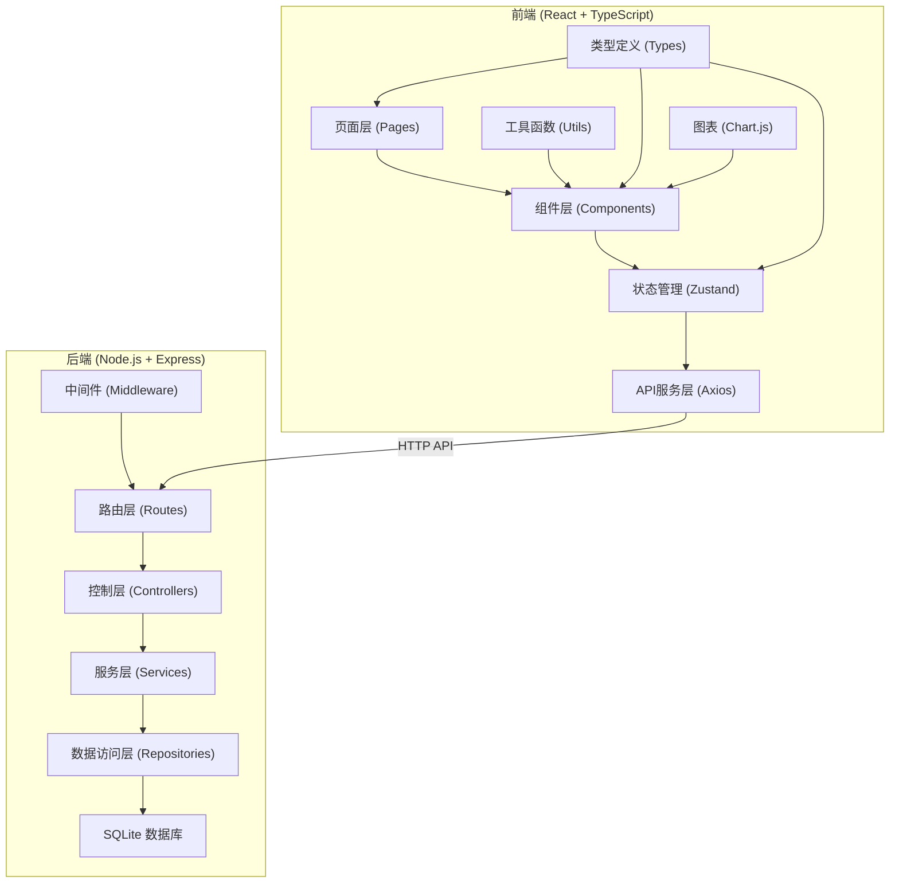
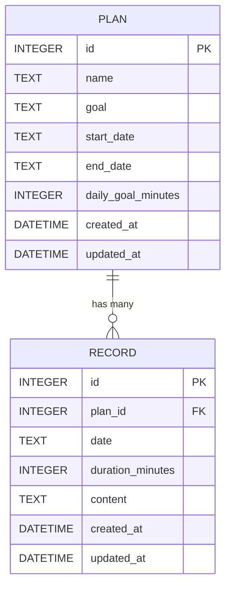
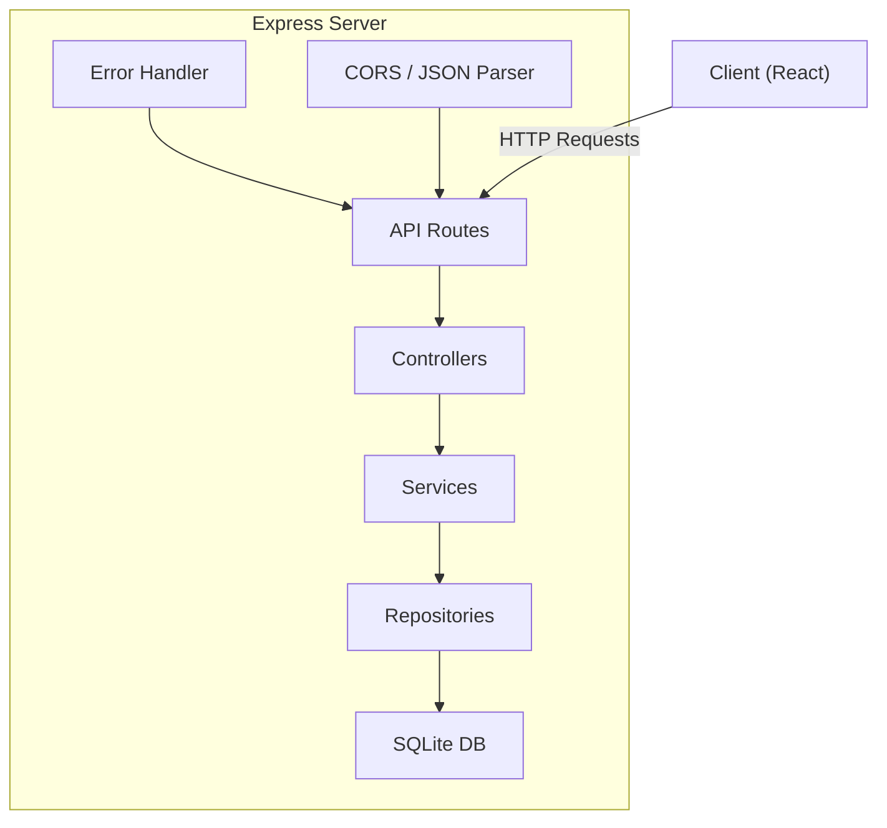

## 1. 架构设计



## 2. 技术栈说明

### 2.1 前端技术
- **框架**: React 18 + TypeScript
- **构建工具**: Vite 5
- **路由**: React Router DOM 6
- **状态管理**: Zustand 4
- **HTTP客户端**: Axios
- **样式**: Tailwind CSS 3
- **图表**: Chart.js + react-chartjs-2
- **图标**: lucide-react
- **日期处理**: date-fns

### 2.2 后端技术
- **框架**: Express 4
- **语言**: TypeScript
- **数据库**: SQLite (better-sqlite3)
- **CORS**: cors 中间件
- **开发服务器**: tsx + nodemon

### 2.3 项目初始化
使用 `react-express-ts` 模板初始化项目：
```
npm init vite-init@latest -y . -- --template react-express-ts --force
```

## 3. 目录结构

```
.
├── .trae/documents/          # 项目文档
├── api/                       # 后端代码
│   ├── src/
│   │   ├── controllers/       # 控制器
│   │   ├── routes/            # 路由定义
│   │   ├── services/          # 业务逻辑
│   │   ├── repositories/      # 数据访问
│   │   ├── models/            # 数据模型
│   │   ├── middleware/        # 中间件
│   │   ├── utils/             # 工具函数
│   │   ├── database.ts        # 数据库连接
│   │   ├── seed.ts            # 示例数据
│   │   └── index.ts           # 入口文件
│   ├── tsconfig.json
│   └── package.json
├── src/                       # 前端代码
│   ├── components/            # 组件
│   │   ├── PlanCard.tsx
│   │   ├── PlanForm.tsx
│   │   ├── RecordForm.tsx
│   │   ├── RecordItem.tsx
│   │   ├── StatsCard.tsx
│   │   ├── AlertBanner.tsx
│   │   ├── FilterBar.tsx
│   │   └── LineChart.tsx
│   ├── pages/                 # 页面
│   │   ├── HomePage.tsx
│   │   └── PlanDetailPage.tsx
│   ├── store/                 # 状态管理
│   │   └── usePlanStore.ts
│   ├── services/              # API服务
│   │   └── api.ts
│   ├── utils/                 # 工具函数
│   │   ├── date.ts
│   │   └── streak.ts
│   ├── types/                 # 类型定义
│   │   └── index.ts
│   ├── App.tsx
│   ├── main.tsx
│   └── index.css
├── shared/                    # 共享类型
│   └── types.ts
├── vite.config.ts
├── tailwind.config.js
├── tsconfig.json
└── package.json
```

## 4. 路由定义

### 4.1 前端路由
| 路由 | 页面 | 说明 |
|-------|---------|------|
| `/` | HomePage | 首页 - 计划列表、统计看板、提醒 |
| `/plans/:id` | PlanDetailPage | 计划详情页 - 记录列表、趋势图、添加记录 |

### 4.2 后端API路由
| 方法 | 路由 | 说明 |
|------|-------|------|
| `GET` | `/api/plans` | 获取所有计划（支持筛选、排序、搜索） |
| `GET` | `/api/plans/:id` | 获取单个计划详情 |
| `POST` | `/api/plans` | 创建新计划 |
| `PUT` | `/api/plans/:id` | 更新计划（开始日期不可改） |
| `DELETE` | `/api/plans/:id` | 删除计划及所有记录 |
| `GET` | `/api/plans/:id/records` | 获取计划的所有记录 |
| `POST` | `/api/plans/:id/records` | 添加学习记录 |
| `PUT` | `/api/plans/:id/records/:recordId` | 更新学习记录 |
| `DELETE` | `/api/plans/:id/records/:recordId` | 删除学习记录 |
| `GET` | `/api/stats/overview` | 获取统计概览数据 |
| `GET` | `/api/stats/alerts` | 获取未学习提醒 |
| `GET` | `/api/plans/:id/export` | 导出计划记录为CSV |
| `GET` | `/api/plans/:id/trend` | 获取最近30天趋势数据 |

## 5. 数据模型

### 5.1 ER图



### 5.2 数据库表定义

```sql
-- 学习计划表
CREATE TABLE IF NOT EXISTS plans (
    id INTEGER PRIMARY KEY AUTOINCREMENT,
    name TEXT NOT NULL,
    goal TEXT NOT NULL,
    start_date TEXT NOT NULL,
    end_date TEXT NOT NULL,
    daily_goal_minutes INTEGER NOT NULL DEFAULT 60,
    created_at DATETIME DEFAULT CURRENT_TIMESTAMP,
    updated_at DATETIME DEFAULT CURRENT_TIMESTAMP
);

-- 学习记录表
CREATE TABLE IF NOT EXISTS records (
    id INTEGER PRIMARY KEY AUTOINCREMENT,
    plan_id INTEGER NOT NULL,
    date TEXT NOT NULL,
    duration_minutes INTEGER NOT NULL,
    content TEXT NOT NULL,
    created_at DATETIME DEFAULT CURRENT_TIMESTAMP,
    updated_at DATETIME DEFAULT CURRENT_TIMESTAMP,
    FOREIGN KEY (plan_id) REFERENCES plans(id) ON DELETE CASCADE,
    UNIQUE(plan_id, date)
);

-- 索引
CREATE INDEX IF NOT EXISTS idx_records_plan_id ON records(plan_id);
CREATE INDEX IF NOT EXISTS idx_records_date ON records(date);
```

### 5.3 TypeScript 类型定义

```typescript
// shared/types.ts
export interface Plan {
  id: number;
  name: string;
  goal: string;
  startDate: string;
  endDate: string;
  dailyGoalMinutes: number;
  createdAt: string;
  updatedAt: string;
}

export interface Record {
  id: number;
  planId: number;
  date: string;
  durationMinutes: number;
  content: string;
  createdAt: string;
  updatedAt: string;
}

export interface PlanWithStats extends Plan {
  totalDays: number;
  studiedDays: number;
  progress: number;
  currentStreak: number;
  longestStreak: number;
  daysSinceLastStudy: number;
  status: 'active' | 'completed';
}

export interface StatsOverview {
  totalPlans: number;
  activePlans: number;
  todayStudyMinutes: number;
  monthStudyDays: number;
  longestGlobalStreak: number;
}

export interface Alert {
  planId: number;
  planName: string;
  days: number;
  severity: 'warning' | 'danger';
}

export interface TrendDataPoint {
  date: string;
  minutes: number;
}
```

## 6. 后端架构



### 6.1 核心模块说明

#### Controllers (控制层)
- 处理 HTTP 请求和响应
- 参数验证
- 调用 Service 层
- 错误处理

#### Services (服务层)
- 业务逻辑处理
- 连续天数计算
- 统计数据计算
- 日期范围验证

#### Repositories (数据访问层)
- 封装数据库操作
- SQL 查询构建
- 事务处理

## 7. 前端状态管理

使用 Zustand 管理全局状态：

```typescript
interface PlanState {
  plans: PlanWithStats[];
  currentPlan: PlanWithStats | null;
  records: Record[];
  stats: StatsOverview | null;
  alerts: Alert[];
  loading: boolean;
  filters: {
    status: 'all' | 'active' | 'completed';
    sortBy: 'startDate' | 'endDate' | 'name';
    search: string;
  };
  
  // Actions
  fetchPlans: () => Promise<void>;
  fetchPlan: (id: number) => Promise<void>;
  createPlan: (data: CreatePlanDto) => Promise<void>;
  updatePlan: (id: number, data: UpdatePlanDto) => Promise<void>;
  deletePlan: (id: number) => Promise<void>;
  addRecord: (planId: number, data: CreateRecordDto) => Promise<boolean>;
  updateRecord: (planId: number, recordId: number, data: UpdateRecordDto) => Promise<void>;
  deleteRecord: (planId: number, recordId: number) => Promise<void>;
  fetchStats: () => Promise<void>;
  fetchAlerts: () => Promise<void>;
  setFilters: (filters: Partial<PlanState['filters']>) => void;
}
```

## 8. 关键业务逻辑

### 8.1 连续学习天数计算
```
1. 获取计划的所有记录日期，按日期降序排列
2. 从今天开始向前遍历
3. 如果今天有记录，从今天开始计数
4. 如果今天没有记录，检查昨天，连续天数从有记录的日期开始
5. 遇到日期不连续（间隔>1天）则重置计数
6. 返回最终连续天数
```

### 8.2 提醒机制
```
对于每个进行中的计划：
  daysSinceLastStudy = 今天日期 - 最近记录日期
  if daysSinceLastStudy >= 5: 红色警示 (danger)
  else if daysSinceLastStudy >= 3: 黄色提醒 (warning)
```

### 8.3 进度计算
```
progress = (studiedDays / totalDays) * 100
其中：
  totalDays = 结束日期 - 开始日期 + 1
  studiedDays = 有记录的天数（去重）
```

## 9. API 错误处理

统一响应格式：
```typescript
interface ApiResponse<T> {
  success: boolean;
  data?: T;
  error?: string;
  message?: string;
}
```

HTTP 状态码：
- `200`: 成功
- `201`: 创建成功
- `400`: 参数错误
- `404`: 资源不存在
- `500`: 服务器错误

## 10. 开发与启动命令

```json
{
  "scripts": {
    "dev": "concurrently \"npm run dev:api\" \"npm run dev:web\"",
    "dev:api": "tsx watch api/src/index.ts",
    "dev:web": "vite",
    "build": "tsc -b && vite build",
    "build:api": "tsc -p api/tsconfig.json",
    "start": "node api/dist/index.js",
    "seed": "tsx api/src/seed.ts",
    "lint": "eslint . --ext ts,tsx --report-unused-disable-directives --max-warnings 0",
    "typecheck": "tsc -b --noEmit"
  }
}
```
