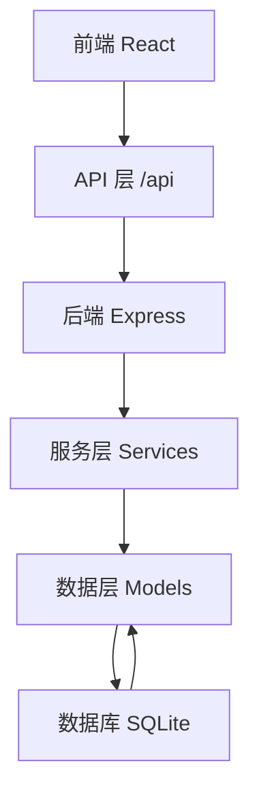
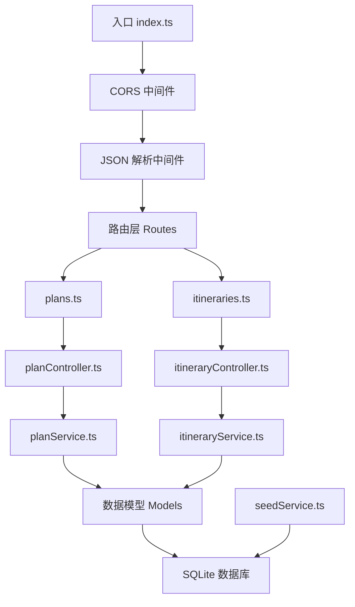
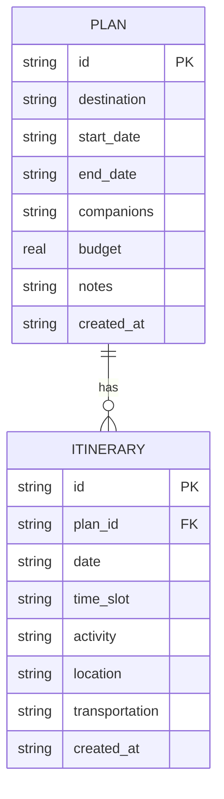

## 1. 架构设计



## 2. 技术描述

- 前端：React 18 + TypeScript + Vite 5 + Tailwind CSS 3 + Zustand + React Router v6 + lucide-react
- 后端：Node.js + Express 4 + TypeScript + better-sqlite3 + cors
- 数据库：SQLite（文件存储，持久化）
- 初始化工具：vite-init
- 图标库：lucide-react

## 3. 目录结构

```
travel-planner/
├── src/                          # 前端代码
│   ├── components/               # 通用组件
│   │   ├── Toast.tsx            # Toast 提示组件
│   │   ├── Modal.tsx            # 弹窗组件
│   │   ├── Badge.tsx            # 状态标签组件
│   │   ├── Button.tsx           # 按钮组件
│   │   └── Input.tsx            # 输入框组件
│   ├── pages/                    # 页面组件
│   │   ├── PlanList.tsx         # 计划列表页
│   │   └── PlanDetail.tsx       # 计划详情页
│   ├── services/                 # API 服务
│   │   ├── planService.ts       # 计划相关 API
│   │   └── itineraryService.ts  # 行程相关 API
│   ├── utils/                    # 工具函数
│   │   ├── dateUtils.ts         # 日期处理
│   │   └── planUtils.ts         # 计划状态计算
│   ├── hooks/                    # 自定义 hooks
│   │   ├── useToast.ts          # Toast 管理
│   │   └── usePlanStats.ts      # 统计计算
│   ├── store/                    # 状态管理
│   │   └── usePlanStore.ts      # 计划状态
│   ├── types/                    # 类型定义
│   │   └── index.ts             # Plan, Itinerary 等类型
│   ├── App.tsx                   # 根组件（路由）
│   └── main.tsx                  # 入口文件
├── api/                          # 后端代码
│   ├── src/
│   │   ├── routes/               # 路由层
│   │   │   ├── plans.ts         # 计划路由
│   │   │   └── itineraries.ts   # 行程路由
│   │   ├── controllers/          # 控制器层
│   │   │   ├── planController.ts
│   │   │   └── itineraryController.ts
│   │   ├── services/             # 服务层
│   │   │   ├── planService.ts
│   │   │   ├── itineraryService.ts
│   │   │   └── seedService.ts   # 示例数据生成
│   │   ├── models/               # 数据模型
│   │   │   ├── Plan.ts
│   │   │   └── Itinerary.ts
│   │   ├── db/                   # 数据库
│   │   │   └── index.ts         # 数据库连接和初始化
│   │   └── index.ts             # 服务入口
│   └── package.json
├── shared/                       # 前后端共享类型
│   └── types.ts
├── README.md
├── package.json
├── tsconfig.json
├── vite.config.ts
├── tailwind.config.js
└── postcss.config.js
```

## 4. 路由定义（前端）

| 路由 | 页面 | 说明 |
|------|------|------|
| `/` | PlanList | 计划列表页 |
| `/plan/:id` | PlanDetail | 计划详情页 |

## 5. API 定义

### 数据类型

```typescript
// 共享类型 shared/types.ts
export type TimeSlot = 'morning' | 'afternoon' | 'evening';
export type PlanStatus = 'upcoming' | 'ongoing' | 'ended';

export interface Plan {
  id: string;
  destination: string;
  startDate: string;  // YYYY-MM-DD
  endDate: string;    // YYYY-MM-DD
  companions?: string;
  budget?: number;
  notes?: string;
  createdAt: string;
}

export interface Itinerary {
  id: string;
  planId: string;
  date: string;       // YYYY-MM-DD
  timeSlot: TimeSlot;
  activity: string;
  location: string;
  transportation?: string;
  createdAt: string;
}

export interface PlanWithItineraries extends Plan {
  itineraries: Itinerary[];
}

// API 响应格式
interface ApiResponse<T> {
  success: boolean;
  data?: T;
  message?: string;
  error?: string;
}
```

### API 端点

| 方法 | 路径 | 说明 | 请求体 | 响应 |
|------|------|------|--------|------|
| GET | `/api/plans` | 获取所有计划 | - | `Plan[]` |
| GET | `/api/plans/:id` | 获取单个计划（含行程） | - | `PlanWithItineraries` |
| POST | `/api/plans` | 创建计划 | `Omit<Plan, 'id' \| 'createdAt'>` | `Plan` |
| PUT | `/api/plans/:id` | 更新计划 | `Omit<Plan, 'id' \| 'createdAt'>` | `Plan` |
| DELETE | `/api/plans/:id` | 删除计划（级联删除行程） | - | `{ message: string }` |
| GET | `/api/plans/:planId/itineraries` | 获取计划的所有行程 | - | `Itinerary[]` |
| POST | `/api/plans/:planId/itineraries` | 创建行程 | `Omit<Itinerary, 'id' \| 'planId' \| 'createdAt'>` | `Itinerary` |
| PUT | `/api/plans/:planId/itineraries/:id` | 更新行程 | `Omit<Itinerary, 'id' \| 'planId' \| 'createdAt'>` | `Itinerary` |
| DELETE | `/api/plans/:planId/itineraries/:id` | 删除行程 | - | `{ message: string }` |
| POST | `/api/plans/:planId/itineraries/:id/copy` | 复制行程 | - | `Itinerary` |

## 6. 服务器架构



## 7. 数据模型

### 7.1 ER 图



### 7.2 DDL

```sql
-- 计划表
CREATE TABLE IF NOT EXISTS plans (
    id TEXT PRIMARY KEY,
    destination TEXT NOT NULL,
    start_date TEXT NOT NULL,
    end_date TEXT NOT NULL,
    companions TEXT,
    budget REAL,
    notes TEXT,
    created_at TEXT DEFAULT CURRENT_TIMESTAMP
);

-- 行程表
CREATE TABLE IF NOT EXISTS itineraries (
    id TEXT PRIMARY KEY,
    plan_id TEXT NOT NULL,
    date TEXT NOT NULL,
    time_slot TEXT NOT NULL CHECK(time_slot IN ('morning', 'afternoon', 'evening')),
    activity TEXT NOT NULL,
    location TEXT NOT NULL,
    transportation TEXT,
    created_at TEXT DEFAULT CURRENT_TIMESTAMP,
    FOREIGN KEY (plan_id) REFERENCES plans(id) ON DELETE CASCADE
);

-- 索引
CREATE INDEX IF NOT EXISTS idx_itineraries_plan_id ON itineraries(plan_id);
CREATE INDEX IF NOT EXISTS idx_itineraries_date ON itineraries(date);
```

### 7.3 示例数据生成规则

应用启动时检查 plans 表是否为空，若为空则生成：

1. **未开始计划**：出发日期 = 今天 + 7 天，返回日期 = 今天 + 14 天
2. **进行中计划**：出发日期 = 今天 - 3 天，返回日期 = 今天 + 5 天

每个计划至少生成 3 天行程，每天至少 1 个活动，覆盖不同时间段（上午、下午、晚上），包含部分冲突场景以便测试冲突检测功能。
