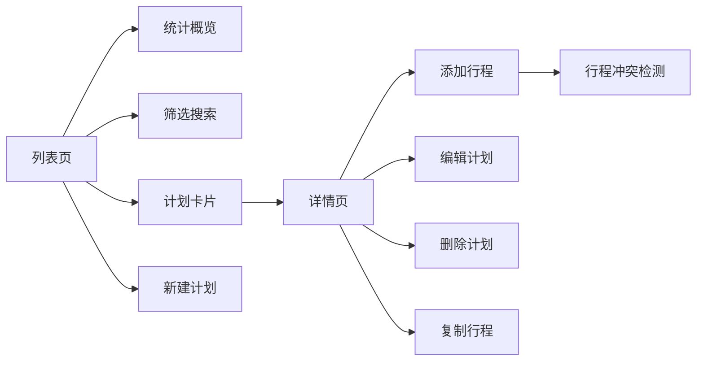

## 1. 产品概述

个人旅行计划管理器是一款帮助用户规划、管理和追踪旅行计划的全栈 Web 应用。用户可以创建旅行计划、安排每日行程、检测行程冲突、查看统计概览，并通过丰富的交互反馈获得流畅的用户体验。

- 主要目的：为旅行者提供直观易用的旅行规划工具
- 解决问题：零散的行程记录、行程冲突、行程规划混乱等问题
- 目标用户：热爱旅行、需要规划行程的个人用户
- 产品价值：提升旅行规划效率，避免行程冲突，提供美好旅行体验

## 2. 核心功能

### 2.1 用户角色

| 角色 | 注册方式 | 核心权限 |
|------|----------|----------|
| 普通用户 | 无需注册，本地使用 | 创建、编辑、删除旅行计划和行程项 |

### 2.2 功能模块

1. **旅行计划管理**：创建、编辑、删除旅行计划，卡片网格展示

2. **每日行程安排**：按日期分组展示行程项，支持添加、编辑、删除

3. **行程冲突检测**：同一时间段冲突警告，确认后可继续添加

4. **统计概览**：总计划数、即将出发（7天内）、进行中数量统计

5. **筛选与排序**：按状态筛选、目的地关键词搜索、出发日期排序

6. **计划详情与编辑**：查看完整信息，编辑所有字段（除ID）

7. **快速复制行程**：一键复制行程项到同一日期

8. **空状态与示例数据**：首次启动自动生成2个示例计划

### 2.3 页面详情

| 页面名称 | 模块名称 | 功能描述 |
|---------|----------|----------|
| 列表页 | 统计概览 | 显示总计划数、即将出发、进行中数量
| 列表页 | 筛选搜索区 | 状态筛选、目的地搜索、日期排序
| 列表页 | 计划卡片网格 | 卡片展示目的地、日期、天数、状态、预算、即将出发徽章
| 列表页 | 新建计划按钮 | 打开新建计划弹窗
| 列表页 | 空状态 | 引导创建计划
| 详情页 | 计划信息展示 | 显示完整计划信息
| 详情页 | 编辑计划按钮 | 打开编辑计划弹窗
| 详情页 | 删除计划按钮 | 二次确认后删除计划
| 详情页 | 添加行程按钮 | 展开内联表单添加行程
| 详情页 | 行程列表 | 按日期分组展示行程项
| 详情页 | 行程操作 | 编辑、删除、复制行程
| 新建/编辑计划弹窗 | 表单 | 目的地、日期、伙伴、预算、备注输入
| 新建/编辑行程表单 | 表单 | 日期、时间段、活动、地点、交通输入
| 冲突警告弹窗 | 警告 | 时间段冲突提示与确认

## 3. 核心流程

用户打开应用 → 查看统计概览和计划列表 → 筛选/搜索计划 → 点击卡片进入详情 → 查看/添加/编辑/删除行程 → 返回列表

## 4. 用户界面设计

### 4.1 设计风格

- 主色调：深青色 #0D9488，辅助色：珊瑚色 #F43F5E（警告/即将出发）
- 按钮风格：圆角 12px，悬停阴影，过渡 300ms
- 字体：ZCOOL XiaoWei（标题）、Lato（正文）
- 布局风格：卡片式网格布局，顶部导航栏
- 图标风格：lucide-react 线性图标
- 动画风格：平滑过渡、微交互、卡片悬停上浮

### 4.2 页面设计概述

| 页面名称 | 模块名称 | UI 元素 |
|---------|----------|----------|
| 列表页 | 统计概览 | 卡片式统计，渐变背景，数字动画，间隔 300ms 错峰显示
| 列表页 | 计划卡片 | 白色卡片，悬停上浮，删除滑出淡出 300ms
| 详情页 | 行程列表 | 时间线布局，按日期分组
| 详情页 | 新增行程高亮 | 淡黄色闪烁 2 次，间隔 300ms
| 冲突警告 | 抖动动画 | 轻微抖动吸引注意

### 4.3 响应式

桌面端优先，移动端自适应，触摸优化。断点：md (768px) 以下单列布局，lg (1024px) 以下两列布局。
